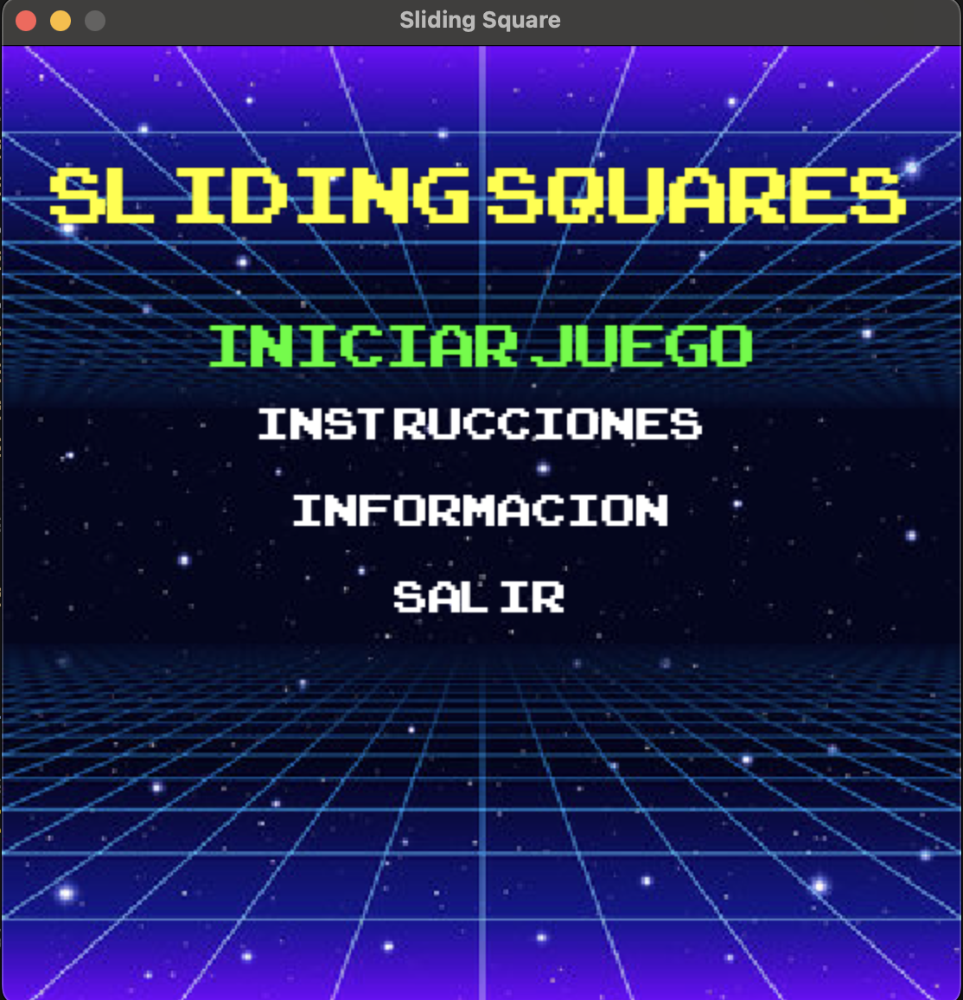
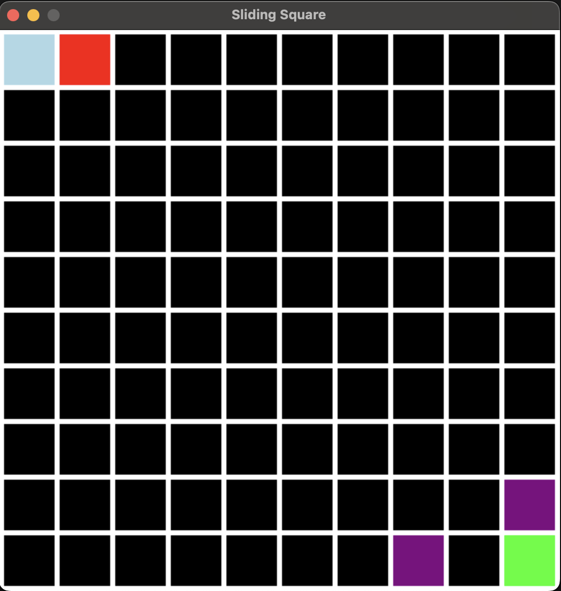
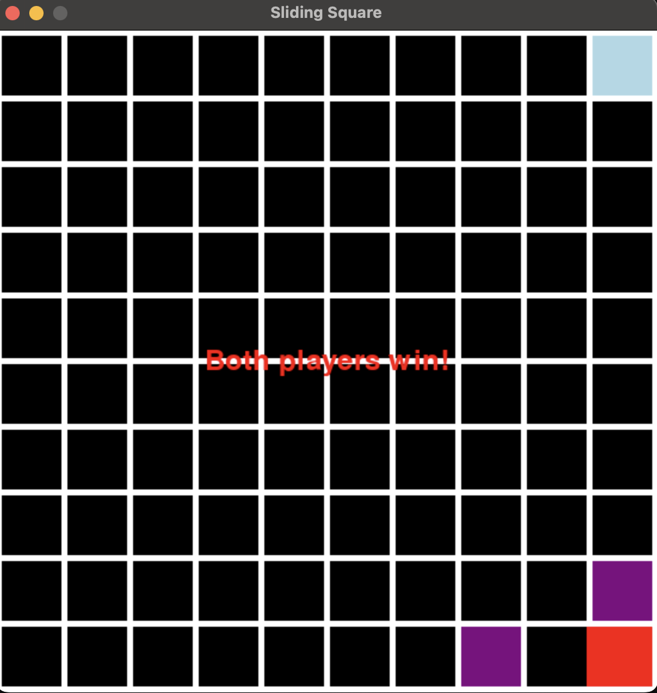
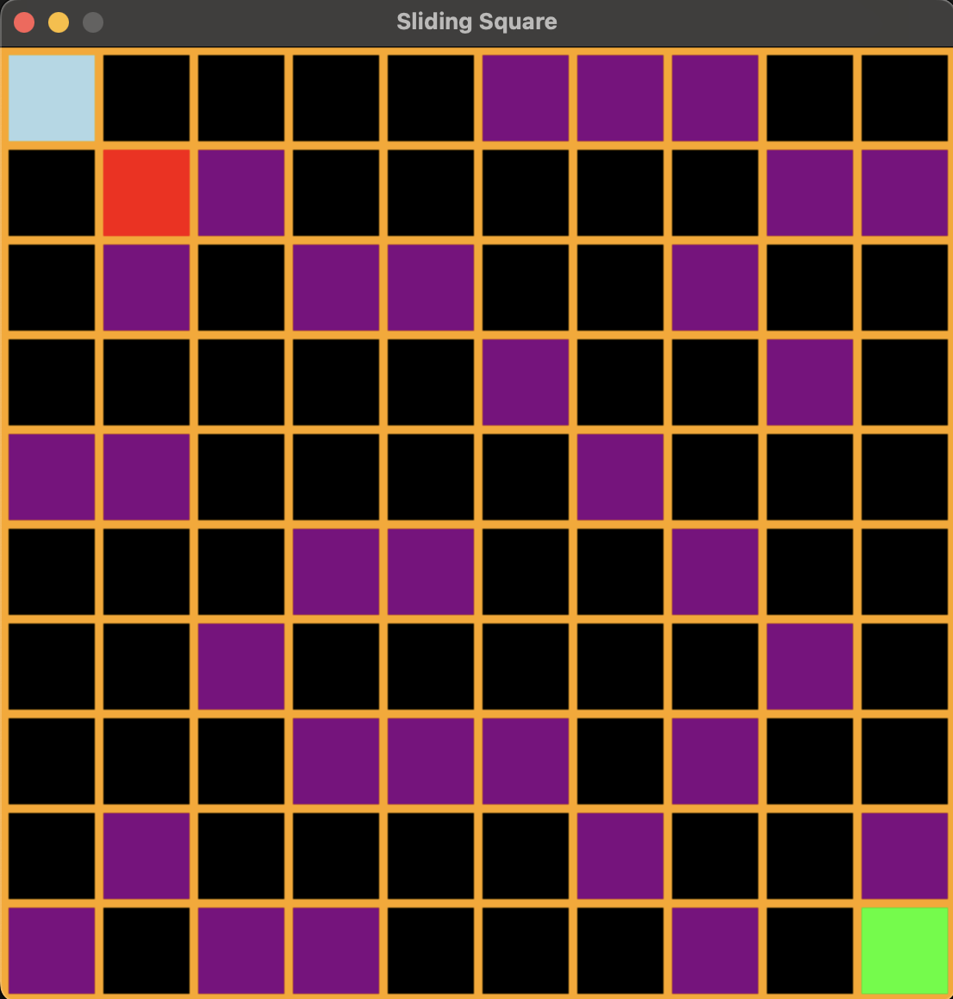

# Sliding Squares: Teamwork Puzzle Game

Welcome to **Sliding Squares** - an exciting 2-player game that challenges you and a friend to slide your way to victory while avoiding obstacles. With simple controls and engaging gameplay, it’s not only fun but also an educational tool that promotes teamwork and strategic thinking.






## Features

- **Multi-Level Challenges**: Progress through various levels, each with unique obstacle layouts.
- **Educational Value**: Encourages teamwork and enhances problem-solving skills.
- **Dynamic Backgrounds**: The background color changes with every move, keeping visuals fresh and exciting.
- **Game Music & Sound Effects**: Immersive background tracks and satisfying sound effects for in-game actions.
- **Joystick Support**: Connect SNES-style joysticks for a retro gaming experience.
- **Smooth Animations**: Fluid sliding animations that bring the game squares to life.

## How to Play

1. **Start the Game**: Select "Start Game" from the main menu.
2. **Control Your Square**:
   - **Player 1**: Use `W` (up), `S` (down), `A` (left), `D` (right).
   - **Player 2**: Use arrow keys.
3. **Avoid Obstacles**: Navigate around purple blocks to reach the green goal.
4. **Reach the Goal**: Guide both squares to their respective goals to unlock the next level.
5. **Teamwork Strategies**: Block paths for your teammate to create new strategies for victory.

## Controls

- **Player 1 (Keyboard)**: `W`, `A`, `S`, `D`
- **Player 2 (Keyboard)**: Arrow keys
- **SNES Joystick**:
  - **Player 1**: `X` (up), `A` (right), `B` (down), `Y` (left)
  - **Player 2**: Use buttons mapped similarly (varies by controller).

## Installation

### Prerequisites
- Python 3.x
- Pygame library

### Steps
1. Clone this repository:
   ```bash
   git clone https://github.com/jorgexe/Sliding_Squares.git
   ```
2. Install dependencies:
   ```bash
   pip install pygame
   ```
3. Run the game:
   ```bash
   python main.py
   ```

## Acknowledgments

A heartfelt thanks to our team members who contributed their passion and skills to create this game:

- Aaron Jimenez
- David Martinez
- Jorge Sandoval

## Version
1.14

---

**Pro Tip**: For the best experience, use joysticks and crank up the volume to enjoy the retro sound effects! 🎮🔊